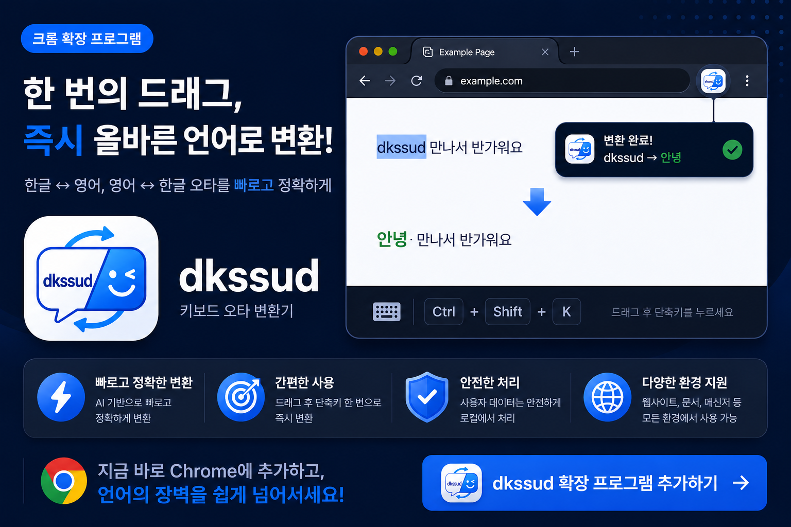

<div align="center">

# ⌨️ dkssud

### 한글·영문 입력 실수를 한 번에 해결하는 Chrome Extension

잘못 입력한 텍스트를 선택하고 **Ctrl + Shift + K**만 누르세요.

영어로 입력한 한글, 한글로 입력한 영어를 즉시 변환합니다.


</div>

---

## ✨ 왜 dkssud인가요?

영어로 입력하려 했는데 한글로 입력되거나,

한글을 입력하려 했는데 영어로 입력한 경험이 있으신가요?

```text
dkssud
↓
안녕
```

```text
ㅗㄷㅣㅣㅐ
↓
hello
```

이제 삭제하고 다시 입력할 필요가 없습니다.

텍스트를 선택한 뒤 단축키만 누르면 됩니다.

---

## 🚀 주요 기능

* 🔄 영어 → 한글 변환
* 🔄 한글 → 영어 변환
* ⚡ 즉시 변환
* ⌨️ 단축키 지원
* 🔒 개인정보 수집 없음
* 🌐 외부 서버 통신 없음

---

## 📷 Screenshots

<p align="center">
  
</p>

---

## 🎯 사용 방법

### 1. 텍스트 선택

잘못 입력된 텍스트를 드래그하여 선택합니다.

### 2. 단축키 입력

```text
Ctrl + Shift + K
```

### 3. 자동 변환

선택된 텍스트가 올바른 언어로 변환됩니다.

---

## 💡 변환 예시

| 입력           | 결과    |
| ------------ | ----- |
| dkssud       | 안녕    |
| dkssudgktpdy | 안녕하세요 |
| ㅗㄷㅣㅣㅐ        | hello |
| 재ㅣㅐ          | world |

---

## 🔒 Privacy

dkssud는 사용자 정보를 수집하거나 저장하지 않습니다.

* 개인정보 수집 없음
* 로그인 없음
* 계정 생성 없음
* 외부 서버 전송 없음
* 광고 없음

모든 변환은 사용자의 브라우저 내부에서 수행됩니다.

---

## 🛠️ Tech Stack

* JavaScript
* Chrome Extension Manifest V3
* Chrome Scripting API

---

## 📦 Installation

Chrome Web Store에서 설치할 수 있습니다.

> Coming Soon

---

<div align="center">

Made with ❤️ by Gyagoo

</div>
